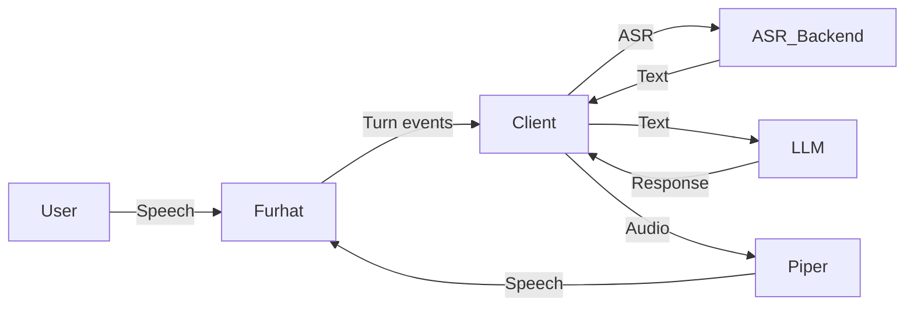
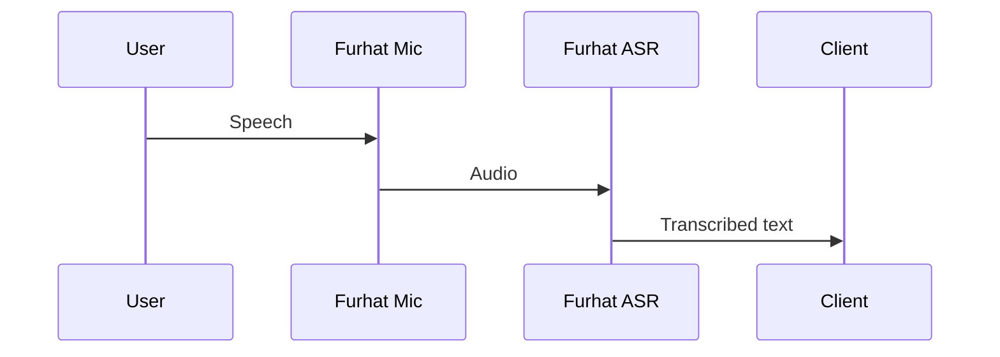
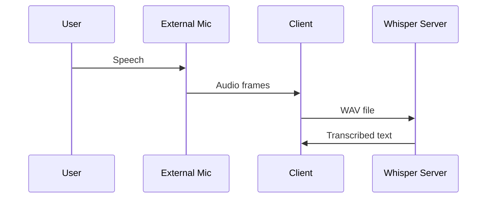
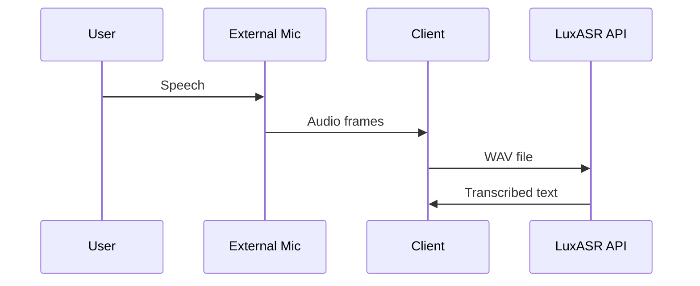
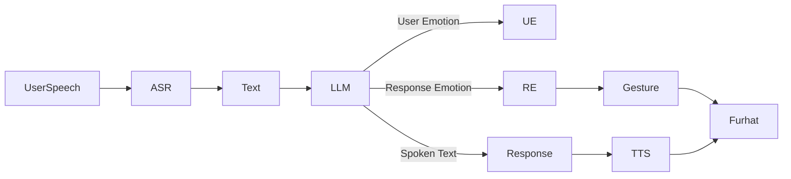
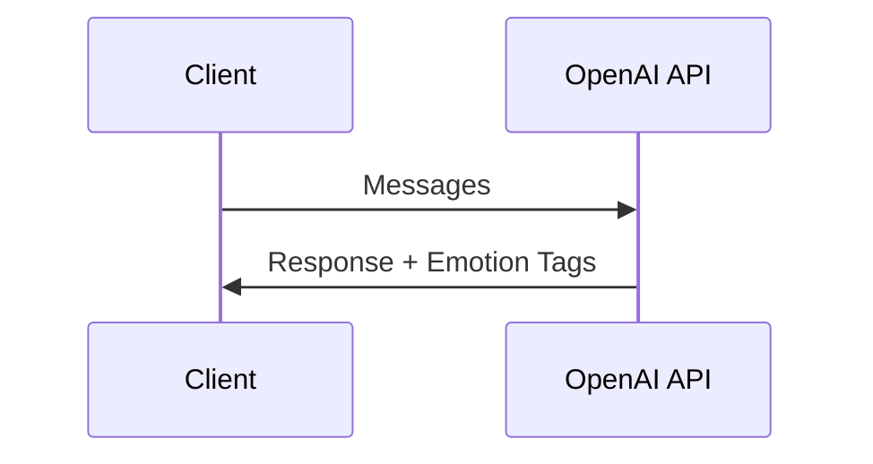
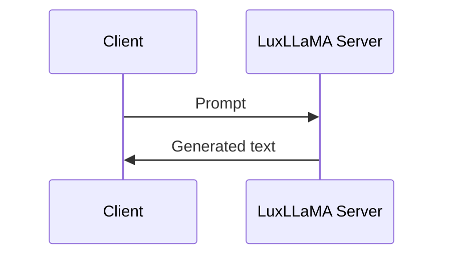

# Physical Furhat Multilingual Voice Assistant

This repository contains a modular, real-time voice assistant system for a **physical Furhat robot**.
The system is designed for **natural, face-to-face human–robot interaction**, with a strong focus on **speech-to-text (STT) architecture, turn-taking, and LLM backend comparison**.

The **default ASR backend is Furhat ASR**. Other ASR backends and **LLM backends** can be selected at runtime.

---

## System Overview

The system is composed of three main layers:

1. **Perception** – Speech-to-text (ASR)
2. **Dialogue** – Language understanding and response generation (LLM)
3. **Expression** – Text-to-speech and robot embodiment

Both the **ASR layer** and the **LLM layer** are modular and configurable at runtime.

---

## High-Level Architecture



---

## Speech-to-Text (ASR) Modes

The ASR backend is selected at runtime using command-line flags.

### Default Mode: Furhat ASR

```bash
python client.py
```

---

### ASR Mode: Furhat ASR

**Description**

* Uses Furhat’s internal microphone
* Speech recognition handled entirely by the Furhat platform
* No external audio recording

```bash
python client.py --furhat
```



---

### ASR Mode: Whisper (Local)

**Description**

* Uses an external microphone
* Audio recorded locally with pre-roll buffering
* Transcription performed by a local Whisper server

```bash
python client.py --whisper
```



---

### ASR Mode: LuxASR

**Description**

* Uses an external microphone
* Audio sent to LuxASR HTTP API
* Optimized for Luxembourgish

```bash
python client.py --luxasr
```



---

## Turn-Taking and Synchronization

Furhat is used exclusively for **interaction timing**.

Key events:

* `response.listen.start`
* `response.hear.start`
* `response.hear.end`
* `response.speak.end`

Audio recording (Whisper / LuxASR):

* Armed on `listen.start`
* Finalized on `hear.end`

This prevents clipped first words and ensures stable conversational timing.

---

## Text-to-Speech (TTS)

* Uses **Piper TTS**
* Runs locally
* Language selected via response prefix (`lb:` / `en:`)
* Audio files served via local HTTP server and played by Furhat

---

## LuxLLaMA LLM Server (GPU)

This project supports running **LuxLLaMA** as a standalone HTTP-based LLM server using **FastAPI** and **Hugging Face Transformers**, optimized for **NVIDIA GPUs**.

The server exposes a `/generate` endpoint that the Furhat client can call to obtain responses.

---

### Purpose

* Enables **local Luxembourgish LLM inference**
* Allows **direct comparison** with OpenAI models
* Runs independently from the Furhat client
* Supports **GPU acceleration (CUDA / fp16)**

---

## Requirements (LuxLLaMA Server)

### Hardware

* NVIDIA GPU (tested on RTX 3070)
* CUDA-capable driver installed on host
* 8 GB+ GPU memory recommended

### Software

* Python **3.9 – 3.11**
* NVIDIA CUDA Toolkit compatible with the installed PyTorch version

### Python Dependencies

Add the following to a dedicated `requirements.txt` for the LuxLLaMA server:

```text
torch>=2.1.0
transformers>=4.38.0
accelerate>=0.26.0
fastapi>=0.110.0
uvicorn[standard]>=0.27.0
pydantic>=2.0
```

> ⚠️ Ensure that **CUDA-enabled PyTorch** is installed. CPU-only builds will not work for GPU inference.

Example (CUDA 12.1):

```bash
pip install torch --index-url https://download.pytorch.org/whl/cu121
```

---

## Running the LuxLLaMA Server

### 1. Create a virtual environment

```bash
python -m venv venv
source venv/bin/activate
pip install -r requirements.txt
```

### 2. Start the server

```bash
uvicorn app:app --host 0.0.0.0 --port 8001
```

The server will be available at:

```text
http://<SERVER_IP>:8001/generate
```

---

## Client Integration

Configure the Furhat client to use the LuxLLaMA server by setting the endpoint URL:

```python
LUXLLAMA_URL = "http://<SERVER_IP>:8001/generate"
```

Run the client with LuxLLaMA enabled:

```bash
python client.py --luxasr --llm luxllama
```

---

## Notes

* The LuxLLaMA server is **stateless**; all conversation history is managed by the client
* Response latency depends on GPU performance and token limits
* No prompt validation or safety filtering is performed at the server level
* Intended for **research and comparison**, not hardened production deployment

---

## Emotion-Aware Dialogue and Gestures

The system supports **emotion-aware conversational interaction** using LLM-based emotion inference and Furhat’s facial gestures.

### Emotion Flow Overview



| Response Emotion | Gesture      |
| ---------------- | ------------ |
| Happy            | Smile        |
| Sad              | ExpressSad   |
| Angry            | ExpressAnger |
| Calm             | Nod          |

---

## LLM Backend Architecture

The dialogue layer supports **multiple interchangeable LLM backends** while keeping the rest of the system **identical**.

This enables **controlled comparison** between commercial cloud models and local open-weight models for spoken human–robot interaction.

### Supported LLM Backends

| Backend  | Type                 | Location  |
| -------- | -------------------- | --------- |
| OpenAI   | Cloud API            | Remote    |
| LuxLLaMA | Local HTTP (FastAPI) | GPU / WSL |

The backend is selected at runtime:

```bash
python client.py --llm openai
python client.py --llm luxllama
```

---

### OpenAI Backend

* Uses OpenAI Chat Completions API
* Full conversational context sent as structured messages
* Emotion tags inferred and returned by the model



---

### LuxLLaMA Backend (Local GPU)

* Runs as a **FastAPI server** on a separate machine or WSL
* Uses Hugging Face `AutoModelForCausalLM`
* Executes on **NVIDIA GPU (fp16)**
* Communicates via HTTP



#### LuxLLaMA Server Startup

```bash
python server.py
```

* Server must bind to `0.0.0.0`
* Port `8001` must be reachable from the client machine

---

### Design Rationale

* Identical ASR, TTS, turn-taking, and embodiment across backends
* Only the **LLM is swapped**
* Enables fair comparison of:

  * Latency
  * Conversational quality
  * Luxembourgish language handling
  * Emotion alignment

---

# Task-Based Prompt Configuration

## Overview

The system supports **task-specific dialogue behavior** via the `TASK_ID` environment variable.

At startup, the client reads `TASK_ID` and automatically appends a **task-specific prompt** to the base system prompt used by the LLM.  
This enables controlled experimental conditions (e.g., different dialogue strategies or objectives) **without modifying code**.

If no task prompt is defined for a given `TASK_ID`, the system falls back to the base prompt only.

---

## How It Works

1. `TASK_ID` is read from the environment at startup
2. A corresponding task prompt is selected from a predefined mapping
3. The task prompt is appended to the base system prompt
4. All other system behavior remains unchanged

Task selection affects **only the LLM system prompt**.

---

## Setting Participant and Task IDs

### PowerShell (Windows)

```powershell
$env:PARTICIPANT_ID="P03"
$env:TASK_ID="5"
python client.py --luxasr
```

### Bash (Linux / macOS)

```bash
export PARTICIPANT_ID=P03
export TASK_ID=5
python client.py --luxasr
```

These values are:

- Stored in interaction logs
- Used to control task-specific LLM behavior

---

## Defining Tasks (Developer Note)

Task prompts are defined in the client code as a mapping:

```python
TASK_PROMPTS = {
    "1": "...",
    "5": "...",
}
```

Each entry contains **additional system-level instructions** appended to the base prompt.

This design enables:

- Rapid addition of new experimental conditions
- Clean separation between core behavior and task logic
- Reproducible experiments without code changes

---

## Design Rationale

- Task-specific prompt injection allows controlled experimental variation
- The dialogue loop, ASR, TTS, and embodiment remain identical across tasks
- Only the LLM system prompt is modified

---

## Project Structure

```text
.
├── client.py
├── server.py
├── models/
│   ├── whisper/
│   └── piper/
├── temp_audio/
└── README.md
```

---

## Requirements

* Python 3.9+
* Furhat robot with Realtime API access
* External microphone (for Whisper / LuxASR)
* NVIDIA GPU (for LuxLLaMA)

Key dependencies:

* furhat-realtime-api
* sounddevice
* soundfile
* aiohttp
* transformers
* torch
* piper-tts
* openai

---

## Running the System

The system can be started **with or without** experimental metadata.
Environment variables are **optional** and only affect logging and LLM prompting behavior.

---

### Optional Environment Variables

The following environment variables may be set **before starting the client**:

- `PARTICIPANT_ID` – used only for labeling interaction logs
- `TASK_ID` – selects an optional task-specific system prompt for the LLM

If these variables are **not set**, the system runs normally using default values.

#### Default Values

| Variable         | Default Value | Effect if Unset |
|------------------|---------------|------------------|
| `PARTICIPANT_ID` | `P_UNKNOWN`   | Logs are still written, but unlabeled |
| `TASK_ID`        | `T_UNKNOWN`   | Base LLM system prompt is used |

---

### Setting Environment Variables (Optional)

#### PowerShell (Windows)

```powershell
$env:PARTICIPANT_ID="P03"
$env:TASK_ID="5"
```

#### Bash (Linux / macOS)

```bash
export PARTICIPANT_ID=P03
export TASK_ID=5
```

---

### Start the Client

The client can be started regardless of whether the environment variables are set.

#### Default (Furhat ASR + OpenAI)

```bash
python client.py
```

#### LuxASR + OpenAI

```bash
python client.py --luxasr
```

#### LuxASR + LuxLLaMA (Local GPU)

```bash
python client.py --luxasr --llm luxllama
```

---

### Notes

- Environment variables do **not** affect ASR, TTS, turn-taking, or embodiment
- Task selection only modifies the **LLM system prompt**
- This design supports controlled experiments while remaining safe for casual use


---

## Acknowledgements

* Furhat Robotics
* LuxASR
* Piper TTS
* Hugging Face
* OpenAI
